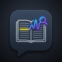

# NotebookLM Highlight to Explain



NotebookLM Highlight to Explain is a Chrome extension for Google NotebookLM. Highlight text in NotebookLM, press `Cmd+E` on macOS or `Ctrl+E` on Windows/Linux/ChromeOS, then add an explain, example, or summarize prompt to the NotebookLM chat panel.

I built this because I could not find a simple NotebookLM tool that turns highlighted text into a useful chat prompt without copying, pasting, and rewriting the same instruction every time.

This is an independent tool and is not affiliated with Google or NotebookLM.

## Features

- Highlight NotebookLM source text, notes, Studio text, or previous chat answers and open a small action popup.
- Choose `1` Explain, `2` Example, or `3` Summarize.
- Insert the generated prompt into NotebookLM chat without submitting it.
- Include the selected source title only when the highlight comes from a NotebookLM source.
- Use `Cmd+E` on macOS or `Ctrl+E` on Windows, Linux, and ChromeOS.

## Install Locally

1. Download or clone this repository.
2. Open `chrome://extensions`.
3. Enable Developer mode.
4. Click **Load unpacked**.
5. Select this project folder.
6. Open or refresh `https://notebooklm.google.com`.

If Chrome does not assign the shortcut because it conflicts with another browser or extension shortcut, open `chrome://extensions/shortcuts` and set **NotebookLM Highlight to Explain** to the shortcut you want.

## Privacy

The extension runs only on `https://notebooklm.google.com/*`. It does not send highlighted text to any external server, does not use analytics, and does not store your NotebookLM content. See [PRIVACY.md](PRIVACY.md) for details.

## Development

Run local validation:

```sh
npm run check
```

The validation script checks JavaScript syntax and confirms that `manifest.json` parses correctly.

Build production package:

```sh
npm run build
```

The build script compiles a clean ZIP bundle inside the `build/` directory, omitting development files (like tests and raw icon artwork) so it is ready for Chrome Web Store upload.

## Chrome Web Store

You can install this extension directly from the <a href="https://chromewebstore.google.com/detail/notebooklm-highlight-to-e/icgojnknmdbdldajaoecliokcmfddcon" target="_blank" rel="noopener noreferrer"><strong>Chrome Web Store</strong></a> (or load it locally as unpacked code using the instructions below).

## Contact

For help, feedback, privacy questions, or bug reports, contact `teklidtr@gmail.com`.

## Notes

- The extension inserts the prompt into chat but does not submit it.
- Source titles are detected only for source selections. Non-source selections are labeled as NotebookLM chat, Studio, notes, or page text.
- NotebookLM is a dynamic Google app, so the chat input is found with a scoring heuristic in `src/content.js`. If Google changes the interface, update `findChatInput()` and `scoreChatCandidate()`.
